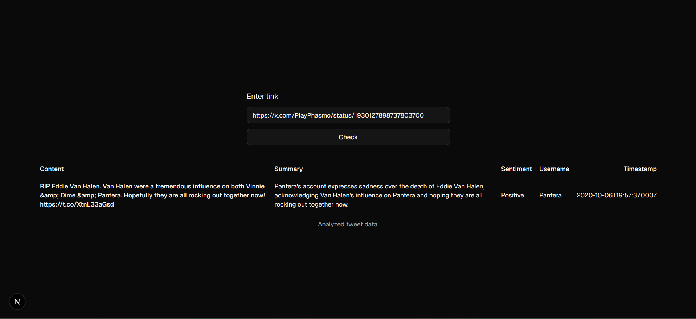
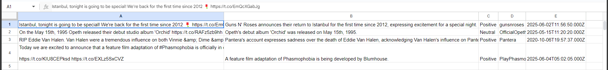

# Swipeline AI Studio Internship Task

## Created by Kaan Yazici

A simple Tweet analyzer tool written in *Next.js*. Used *Google Gemini* as main prompting tool.

### How it works?
1. A *Twitter* / *X* compliant URL is entered to the input field. A simple `Zod` validator checks if its a valid URL. 
2. Then that URL is parsed for its *tweet id* only if it's of correct format. A regex matcher checks for a valid 
*Twitter* URL.
3. Then, through `Twitter API`, Tweet contents are pulled.
4. Contents are fed to an LLM with templates set to prompt about its:
   - Short summary,
   - Sentimental analysis,
   - Poster username (hinted through pulled post metadata),
   - Post timestamp (hinted through pulled post metadata),
   - Post content (hinted through pulled post metadata).
5. Prompt results are returned in a structured JSON format, which is provided with `Zod`. If results are okay, the 
return value is appended to a `Google Sheets` sheet with order:

| Content | Summary | Sentimental Analysis | Username | Timestamp         |
|---------|---------|----------------------|----------|-------------------|

Example successful client:

Example sheet:



### Basic Usage
- Clone project.
```bash
pnpm dev
# or 
npm run dev
```
- Create `.env` file and add necessary API keys for, such as, LLM, Twitter, 
Spreadsheet ID, etc.

[Link](https://docs.google.com/spreadsheets/d/1gOdg2cGRELPxkCIuth3ZEKh93qgDnMs_9w7vSwxDSgY/edit?gid=0#gid=0) to 
Google Sheets sheet (read-only).

